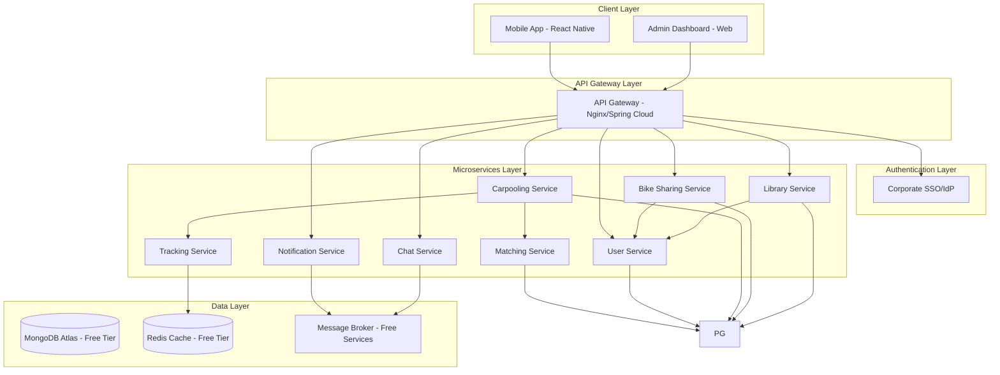
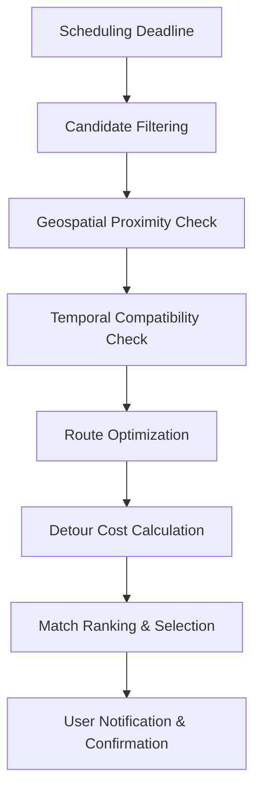
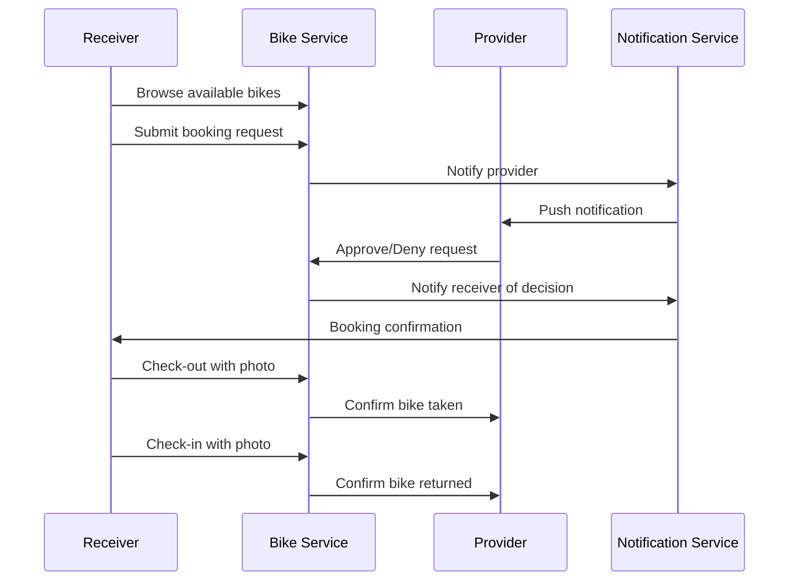
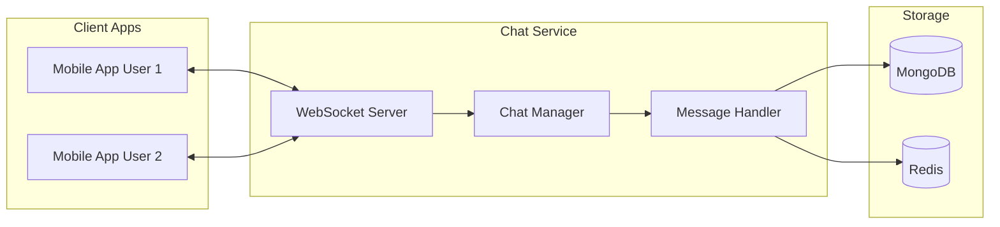
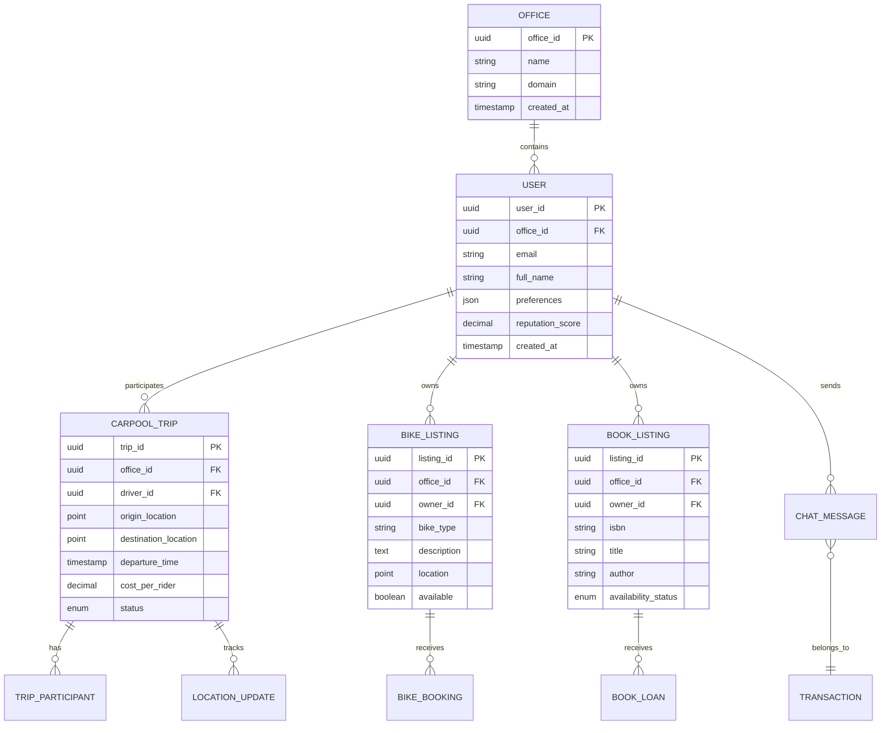

# OfficeShare Platform Design Document

## Overview

The OfficeShare platform is designed as a microservices-based architecture that unifies three distinct sharing modules within a secure, corporate environment. The design prioritizes scalability, security, and user experience while leveraging the inherent trust of a closed office ecosystem.

### Core Design Principles

1. **Unified Identity Management**: Single Sign-On integration eliminates friction and ensures security
2. **Microservices Architecture**: Modular design enables independent scaling and development
3. **Office-Level Isolation**: All data operations respect office boundaries for security and future scalability
4. **Trust-First Design**: Leverage existing corporate trust relationships to minimize verification overhead

## Architecture

### High-Level System Architecture

### Microservices Architecture

The platform consists of specialized microservices, each responsible for specific domain functionality:

| Service                  | Technology Stack                 | Primary Responsibilities                         |
| ------------------------ | -------------------------------- | ------------------------------------------------ |
| **API Gateway**          | Nginx/Spring Cloud Gateway       | Request routing, authentication, rate limiting   |
| **User Service**         | Node.js/Express, MongoDB         | User profiles, SSO integration, ratings          |
| **Carpooling Service**   | Node.js/Express, MongoDB         | Ride management, scheduling, cost calculation    |
| **Bike Sharing Service** | Node.js/Express, MongoDB         | Bike listings, bookings, check-in/out workflow   |
| **Library Service**      | Node.js/Express, MongoDB         | Book cataloging, borrowing workflow              |
| **Matching Service**     | Node.js/Express, MongoDB         | Algorithm-based matching for rides and resources |
| **Tracking Service**     | Node.js, Redis (Free), Socket.IO | Real-time GPS tracking and location updates      |
| **Notification Service** | Node.js, Firebase FCM (Free)     | Push notifications, emails, in-app alerts        |
| **Chat Service**         | Node.js/Socket.IO, MongoDB       | Real-time messaging for transaction coordination |

## Components and Interfaces

### Authentication & User Management

**SSO Integration Architecture:**

- Integration with corporate identity providers (Microsoft Entra ID, Okta)
- Mobile apps use MSAL (Microsoft Authentication Library) for seamless authentication
- JWT tokens for service-to-service communication
- Role-based access control for admin functions

**User Profile Management:**

- Centralized user profiles with preferences and settings
- Reputation scores aggregated from all modules
- Activity history and transaction records
- Privacy controls for profile visibility

### Carpooling Module Design

**Scheduling System:**

- Separate AM/PM trip scheduling with configurable deadlines
- Flexible role selection (Driver/Rider) per trip
- Recurring schedule templates for regular commuters

**Matching Algorithm:**

**Cost-Splitting Logic:**

- Automatic calculation based on distance, fuel costs, and tolls
- Integration with payment gateways (Stripe) or internal wallet system
- Transparent cost breakdown displayed to all participants

**Real-Time Tracking:**

- GPS coordinate streaming every 15-30 seconds during active trips
- WebSocket connections for real-time location updates
- Geofencing for pickup/dropoff notifications

### Bike Sharing Module Design

**P2P Listing System:**

- Photo upload and bike specification management
- Availability calendar with time slot booking
- Location-based discovery with map integration

**Booking Workflow:**

**Security & Accountability:**

- Mandatory photo documentation for check-in/out
- Digital waiver and terms acceptance
- Smart lock integration recommendations
- Condition reporting system

### Library Module Design

**Cataloging System:**

- ISBN barcode scanning with automatic metadata retrieval
- Integration with Open Library API or Google Books API
- Personal "Shared Shelf" management
- Office-wide Public Access Catalog (OPAC)

**Circulation Management:**

- Request/approval workflow between colleagues
- Automated due date tracking and reminders
- Physical pickup/drop-off point coordination
- No points-based system - community goodwill model

### Communication System Design

**Context-Aware Chat:**

- Transaction-specific chat threads
- Real-time messaging with WebSocket connections
- Message history tied to specific sharing transactions
- Offline message delivery with push notifications

**Chat Architecture:**

## Data Models

### Core Entity Relationships

### Database Design Considerations

**Multi-Tenancy Preparation:**

- All tables include `office_id` column for future multi-office expansion
- Database queries are office_id-aware by default
- Indexes optimized for office-scoped operations

**Geospatial Data:**

- PostGIS extension for efficient location-based queries
- Spatial indexes for proximity searches
- Support for route calculations and geofencing

**Performance Optimization:**

- Redis caching for frequently accessed data
- Database connection pooling
- Asynchronous processing for non-critical operations

## Error Handling

### Graceful Degradation Strategy

**Service Availability:**

- Circuit breaker patterns for service-to-service communication
- Fallback mechanisms for non-critical features
- Health check endpoints for all services

**Data Consistency:**

- Eventual consistency model for cross-service operations
- Compensating transactions for failed operations
- Event sourcing for critical business operations

**User Experience:**

- Informative error messages without technical details
- Retry mechanisms for transient failures
- Offline capability for core mobile app functions

### Monitoring and Alerting

**Application Monitoring:**

- Distributed tracing across microservices
- Performance metrics and SLA monitoring
- Real-time error tracking and alerting

**Business Metrics:**

- Usage analytics for each sharing module
- User engagement and retention metrics
- Environmental impact calculations (CO2 savings)

## Testing Strategy

### Testing Pyramid Approach

**Unit Testing:**

- Comprehensive unit tests for business logic
- Mock external dependencies
- Target 80%+ code coverage for critical paths

**Integration Testing:**

- API contract testing between services
- Database integration tests
- Third-party service integration tests (SSO, payment gateways)

**End-to-End Testing:**

- Critical user journey automation
- Cross-platform mobile app testing
- Performance testing under load

**Security Testing:**

- Authentication and authorization testing
- Data privacy compliance verification
- Penetration testing for API endpoints

### Quality Assurance Process

**Continuous Integration:**

- Automated testing pipeline for all code changes
- Code quality gates and security scanning
- Automated deployment to staging environments

**User Acceptance Testing:**

- Beta testing with select office employees
- Feedback collection and iteration cycles
- Accessibility compliance testing

## Deployment Architecture

### Containerization and Orchestration

**Docker Containerization:**

- Each microservice packaged as Docker container
- Multi-stage builds for optimized image sizes
- Security scanning for container vulnerabilities

**Kubernetes Orchestration:**

- Service mesh for inter-service communication
- Auto-scaling based on demand
- Rolling deployments with zero downtime

**Cloud Infrastructure:**

- Multi-region deployment for disaster recovery
- Load balancing and CDN for global performance
- Managed database services for reliability

### DevOps and Monitoring

**CI/CD Pipeline:**

- GitOps workflow with automated deployments
- Environment-specific configuration management
- Rollback capabilities for failed deployments

**Observability:**

- Centralized logging with structured data
- Metrics collection and visualization
- Distributed tracing for performance analysis
